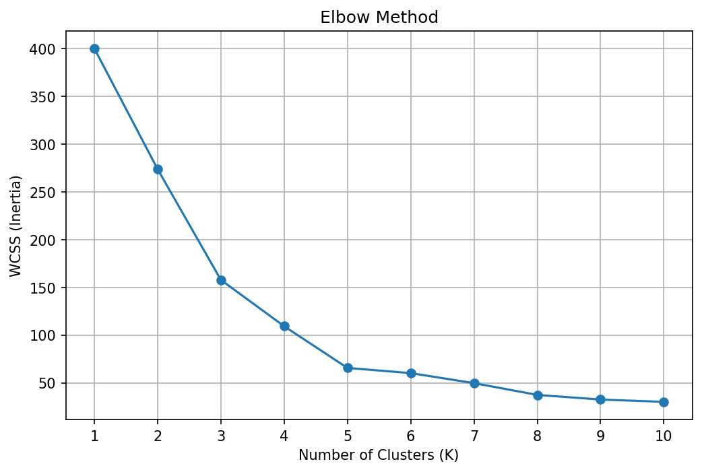
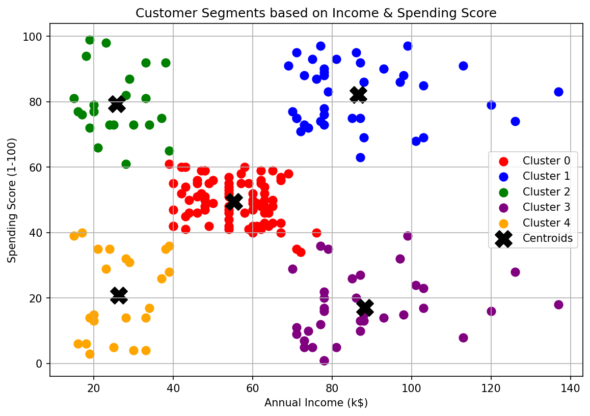

# 🛍️ Customer Segmentation using K-Means Clustering

## 📌 Overview

This project implements **K-Means Clustering**, an unsupervised machine learning algorithm, to segment mall customers into distinct groups based on their **Annual Income** and **Spending Score**.

Customer segmentation helps businesses understand customer behavior, identify valuable customers, and create targeted marketing strategies.

---

## 🎯 Objective

The objective of this project is to:

* Apply the K-Means clustering algorithm.
* Determine the optimal number of clusters using the Elbow Method.
* Visualize customer segments.
* Analyze customer purchasing behavior.
* Identify potential customer groups for business decision-making.

---

## 📂 Dataset

**Mall Customer Dataset**

The dataset contains information about 200 mall customers with the following attributes:

| Feature                | Description                       |
| ---------------------- | --------------------------------- |
| CustomerID             | Unique customer identifier        |
| Gender                 | Male/Female                       |
| Age                    | Customer age                      |
| Annual Income (k$)     | Annual income in thousand dollars |
| Spending Score (1-100) | Customer spending behavior score  |

---

## 🛠️ Technologies Used

* Python
* Pandas
* NumPy
* Matplotlib
* Scikit-Learn

---

## ⚙️ Implementation Steps

### 1. Data Loading

The dataset is loaded using Pandas and inspected for structure and missing values.

### 2. Feature Selection

The following features are selected for clustering:

* Annual Income (k$)
* Spending Score (1-100)

### 3. Feature Scaling

Standardization is performed using `StandardScaler` to ensure both features contribute equally.

### 4. Elbow Method

The Elbow Method is used to determine the optimal number of clusters by analyzing WCSS (Within Cluster Sum of Squares).

### 5. K-Means Clustering

The K-Means algorithm is applied with **K = 5** clusters.

### 6. Visualization

Customer groups and cluster centroids are visualized using scatter plots.

### 7. Result Analysis

Cluster characteristics are analyzed to understand customer purchasing patterns.

---

## 📊 Elbow Method Result

The Elbow Method helps determine the optimal number of clusters.



---

## 📈 Customer Segmentation Result

The scatter plot below shows the final customer clusters along with cluster centroids.



---

## 🚀 How to Run

### Install Dependencies

```bash
pip install pandas matplotlib scikit-learn
```

### Run the Program

```bash
python kmeans_customers.py
```

---

## 📁 Project Structure

```text
SC_ML_02/
│
├── Mall_Customers.csv
├── kmeans_customers.py
├── elbow_plot.png
├── cluster_plot.png
├── clustered_customers.csv
├── README.md
└── .gitignore
```

---

## 📋 Output Files

| File                    | Description                    |
| ----------------------- | ------------------------------ |
| elbow_plot.png          | Elbow Method visualization     |
| cluster_plot.png        | Customer cluster visualization |
| clustered_customers.csv | Dataset with cluster labels    |

---

## 💡 Business Insights

The clustering process can identify customer groups such as:

* 💎 High Income – High Spending (VIP Customers)
* 🎯 High Income – Low Spending (Potential Targets)
* 🛒 Low Income – High Spending (Frequent Shoppers)
* 📉 Low Income – Low Spending (Budget Customers)
* ⚖️ Average Income – Average Spending (Regular Customers)

These insights help businesses improve customer retention and marketing strategies.

---

## 🎓 Machine Learning Concept

This project demonstrates:

* Unsupervised Learning
* K-Means Clustering
* Feature Scaling
* Elbow Method
* Data Visualization
* Customer Segmentation

---

